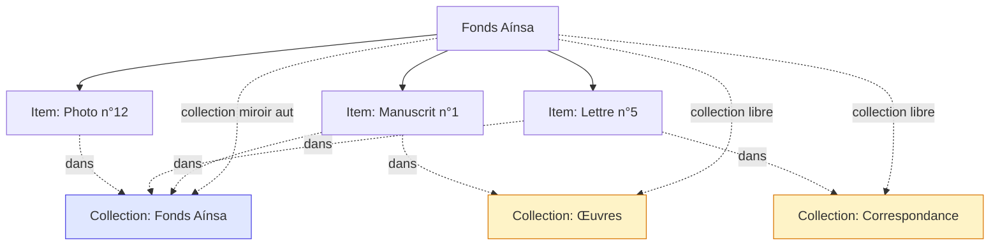

# Concepts du modèle

ColleC distingue trois entités principales : **Fonds**, **Collection**
et **Item**. Cette page définit ces concepts et les relations entre
eux. Toutes les autres pages de cette documentation s'appuient sur
le vocabulaire posé ici.

Le modèle est conçu pour s'aligner avec [Nakala](https://nakala.fr/)
(la plateforme française de publication pour les SHS) tout en
permettant un travail interne plus riche. Concrètement :

- côté Nakala, tout est plat — collections + items publiés ;
- côté ColleC, on ajoute la notion de **Fonds** comme conteneur
  de travail interne, qui n'apparaît jamais dans les exports.

## Diagramme conceptuel

Un fonds *Aínsa* contient trois items. La **collection miroir** (en
bleu) regroupe tous les items du fonds, créée automatiquement.
Deux **collections libres** (en jaune) sélectionnent des items selon
des critères thématiques. Chaque item peut figurer dans plusieurs
collections.

## Fonds

Un **Fonds** représente un corpus matériel cohérent : un don, une
collection physique acquise, un dépôt. C'est l'unité de gestion
côté ColleC.

Caractéristiques :

- identifié par une **cote** unique (ex. `FA` pour Fonds Aínsa,
  `HK` pour Hara-Kiri) ;
- porte les métadonnées de provenance (responsable archives,
  personnalité associée, période, descriptions publique/interne) ;
- pour les fonds de revues : éditeur, périodicité, ISSN ;
- contient des **Items** (le matériel numérisé) ;
- possède toujours une **collection miroir** (créée
  automatiquement à la création du fonds, voir plus bas).

Le Fonds n'existe pas dans Nakala — c'est une notion ColleC pour
organiser le travail interne. Lors d'un export Nakala, c'est la
*collection miroir* du fonds qui devient une collection Nakala,
pas le fonds lui-même.

## Item

Un **Item** est une unité de matériel : un numéro de revue, un
manuscrit, une lettre, une photographie. C'est l'unité publiable
sur Nakala (un item ColleC ↔ une « donnée » Nakala).

Caractéristiques :

- appartient à **exactement un fonds** (relation immuable — un
  item ne change jamais de fonds) ;
- identifié par une **cote** unique au sein de son fonds (deux
  fonds peuvent avoir un item de cote `001` sans conflit) ;
- porte les métadonnées descriptives : titre, date EDTF, langue
  ISO 639-3, type COAR, descriptions, métadonnées custom ;
- possède un **état de catalogage** (`brouillon`, `a_verifier`,
  `verifie`, `valide`, `a_corriger`) ;
- contient des **Fichiers** (scans + dérivés générés) ;
- peut figurer dans plusieurs **Collections** (multi-appartenance,
  voir plus bas).

## Collection

Une **Collection** est un regroupement d'items. C'est aussi la
notion qu'utilise Nakala (une collection Nakala = un regroupement
publiable de DOIs).

ColleC distingue **trois types** de collections :

### Collection miroir

Créée **automatiquement** à la création d'un fonds. Une et une seule
par fonds.

- porte par défaut le même titre et la même cote que son fonds ;
- contient automatiquement tous les items du fonds ;
- sert de point de rattachement Nakala pour le fonds entier ;
- ne peut pas être supprimée indépendamment du fonds (cascade
  uniquement à la suppression du fonds).

Quand vous publiez un fonds entier sur Nakala, c'est sa collection
miroir qui devient la collection Nakala. C'est le cas le plus
courant.

### Collection libre rattachée

Créée **manuellement** par l'archiviste pour regrouper une
sélection d'items d'un même fonds.

- rattachée à un fonds (relation `fonds_id` non null) ;
- contient une sélection d'items du fonds ;
- peut être supprimée sans toucher au fonds ni aux items ;
- sur Nakala, elle peut devenir une collection autonome ou rester
  interne.

Exemple : pour le Fonds Aínsa, on peut créer « Œuvres »,
« Correspondance », « Documentation », « Photographies » — quatre
sous-vues thématiques d'un même corpus.

### Collection libre transversale

Créée pour regrouper des items issus de **plusieurs fonds**.

- pas de fonds parent (`fonds_id` est `NULL`) ;
- contient des items provenant de fonds différents ;
- sur Nakala, devient une collection thématique transversale.

Exemple : une exposition virtuelle « Voix d'Amérique latine en
France » qui pioche dans Aínsa, Manet, et d'autres fonds.

## Multi-appartenance des items

Un item peut figurer dans **plusieurs collections simultanément** :

- toujours dans la **collection miroir** de son fonds par défaut
  (ajout automatique à la création) ;
- éventuellement dans une ou plusieurs **collections libres
  rattachées** au même fonds ;
- éventuellement dans une ou plusieurs **collections transversales**.

Exemple : la lettre `FA-CORRESP-005` (du Fonds Aínsa) peut être :

- dans la miroir « Fonds Aínsa » (par défaut) ;
- dans la libre « Correspondance » (regroupement thématique au sein
  du fonds) ;
- dans la transversale « Témoignages d'exil » (avec des items
  d'autres fonds).

Ces appartenances sont gérées via une table de liaison N-N
(`ItemCollection`). Ajouter ou retirer un item d'une collection ne
modifie ni l'item ni le fonds.

## Cote

La **cote** est un identifiant alphanumérique court (pattern
`^[A-Za-z0-9_-]+$`). Règles d'unicité :

| Entité     | Unicité de la cote                              |
| ---------- | ----------------------------------------------- |
| Fonds      | Globale (deux fonds ne peuvent pas partager une cote). |
| Collection | Par fonds (deux fonds peuvent avoir une collection de même cote ; les transversales se distinguent à l'absence de `fonds_id`). |
| Item       | Par fonds (deux fonds peuvent avoir un item `001`). |

Les commandes CLI offrent un sélecteur `--fonds` pour désambiguïser
quand une cote de collection ou d'item est partagée — voir
[Conventions CLI](cli/index.md#désambiguïsation).

## Invariants du modèle

Quelques règles toujours vraies (vérifiées par les
[contrôles qa](../reference/controles.md) et au niveau du schéma) :

1. **Tout fonds a exactement une collection miroir.**
2. **Toute collection miroir a un fonds parent.**
3. **Toute collection miroir est unique pour son fonds** (CHECK
   en base, vérifié par `INV1`).
4. **Tout item a un fonds parent (immuable).** `Item.fonds_id` est
   `NOT NULL`.
5. **À la création d'un fonds, sa miroir est créée
   automatiquement.** Géré par le service `creer_fonds`.
6. **À la création d'un item dans un fonds, il est ajouté
   automatiquement à la miroir de ce fonds.** Géré par le service
   `creer_item`.
7. **Un item peut être retiré de la collection miroir
   manuellement** sans être supprimé du fonds. Cas rare, signalé
   en avertissement par `INV6`.
8. **Une cote de collection ou d'item est unique au sein d'un
   fonds.**
9. **À la suppression d'un fonds** : items et miroir supprimés en
   cascade ; les collections libres rattachées sont déliées (le
   fonds référencé disparaît, à l'archiviste de rattacher ailleurs
   ou de transformer en transversale).
10. **Une collection libre transversale peut piocher dans
    n'importe quel fonds**, y compris des fonds créés a posteriori.

## Vocabulaire de référence

| Terme                            | Définition courte                                                                                                         |
| -------------------------------- | ------------------------------------------------------------------------------------------------------------------------- |
| Fonds                            | Corpus matériel cohérent (don, dépôt). Notion ColleC, pas Nakala.                                                         |
| Collection                       | Regroupement publiable d'items. Notion ColleC ET Nakala.                                                                  |
| Collection miroir                | Créée automatiquement à la création du fonds. Reflète le fonds entier.                                                    |
| Collection libre rattachée       | Sélection d'items d'un fonds, créée manuellement.                                                                         |
| Collection libre transversale    | Sélection d'items de plusieurs fonds, créée manuellement.                                                                 |
| Item                             | Unité de matériel (numéro de revue, manuscrit, photo). Granularité Nakala.                                                |
| Fichier                          | Scan ou dérivé rattaché à un item. `Fichier.racine` + `chemin_relatif`.                                                   |
| Cote                             | Identifiant alphanumérique. Unique globalement pour un fonds, par fonds pour collections et items.                        |
| Multi-appartenance               | Un item peut figurer dans plusieurs collections simultanément (junction `ItemCollection`).                                |
| EDTF                             | *Extended Date/Time Format* — format des dates `Item.date` (`1969`, `1969-04`, `1969?`, `192X`).                          |
| Type COAR                        | URI du vocabulaire [COAR Resource Types](https://vocabularies.coar-repositories.org/resource_types/) — `Item.type_coar`.  |

## Pour aller plus loin

- [Schéma de données](../reference/schema.md) — détail du modèle
  SQLite, contraintes, relations.
- [Profils d'import](../reference/profils.md) — comment décrire un
  fonds et sa miroir dans un YAML d'import.
- [Conventions CLI](cli/index.md) — sélecteurs `--fonds` /
  `--collection` / `--item` partagés par toutes les commandes.
- [Contrôles qa](../reference/controles.md) — comment les
  invariants ci-dessus sont vérifiés en pratique.
